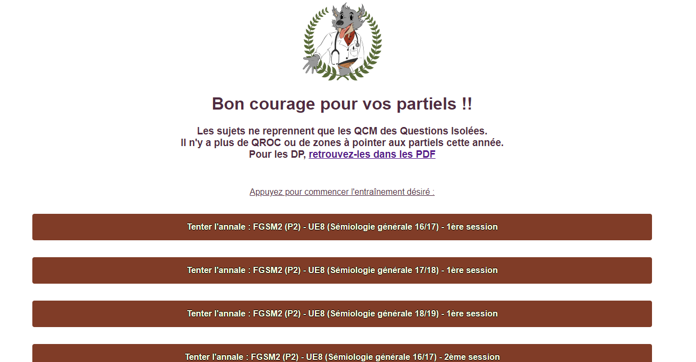
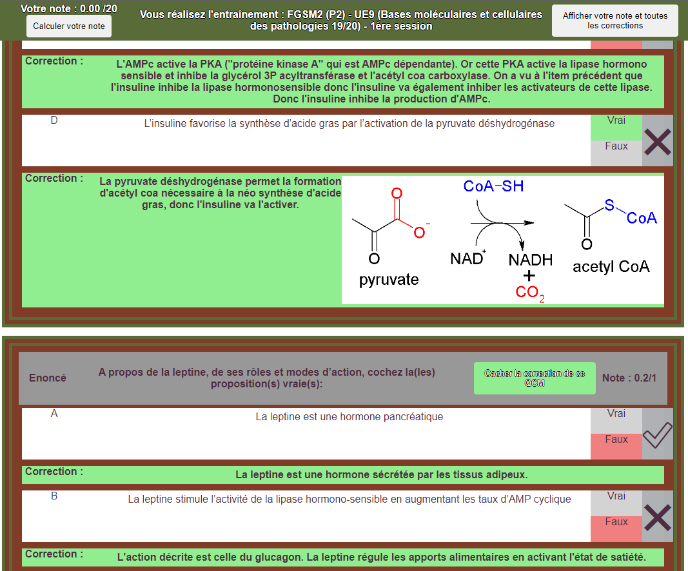

<!-- Improved compatibility of back to top link: See: https://github.com/othneildrew/Best-README-Template/pull/73 -->
<a name="readme-top"></a>
<!--
*** Thanks for checking out the Best-README-Template. If you have a suggestion
*** that would make this better, please fork the repo and create a pull request
*** or simply open an issue with the tag "enhancement".
*** Don't forget to give the project a star!
*** Thanks again! Now go create something AMAZING! :D
-->


<!-- PROJECT SHIELDS -->
<!--
*** I'm using markdown "reference style" links for readability.
*** Reference links are enclosed in brackets [ ] instead of parentheses ( ).
*** See the bottom of this document for the declaration of the reference variables
*** for contributors-url, forks-url, etc. This is an optional, concise syntax you may use.
*** https://www.markdownguide.org/basic-syntax/#reference-style-links
-->
[![Contributors][contributors-shield]][contributors-url]
[![Forks][forks-shield]][forks-url]
[![Stargazers][stars-shield]][stars-url]
[![Issues][issues-shield]][issues-url]
[![AGPLv3 license][license-shield]][license-url]


<!-- PROJECT LOGO -->
<br />
<div align="center">
  <a href="http://annales.tutoratcarabienancy.org/">
    
  </a>

  <h3 align="center">Entraînements du Tutorat de la Carabie Nancéienne</h3>


  <p align="center">
    This project is a web app displaying exam training sessions for students.<br> 
    It is currently used for serving past exams sessions for students in second and third years of Medical School of Nancy, France.
    <br />
    <a href="https://github.com/guatty/exam-training"><strong>Explore the docs »</strong></a>
    <br />
    <br />
    <a href="http://annales.tutoratcarabienancy.org/">View Demo</a>
    ·
    <a href="https://github.com/guatty/exam-training/issues">Report Bug</a>
    ·
    <a href="https://github.com/guatty/exam-training/issues">Request Feature</a>
  </p>
</div>


## Table of Contents
  <ol>
    <li>
      <a href="#about-the-project">About The Project</a>
      <ul>
        <li><a href="#built-with">Built With</a></li>
      </ul>
    </li>
    <li>
      <a href="#getting-started">Getting Started</a>
      <ul>
        <li><a href="#prerequisites">Prerequisites</a></li>
      </ul>
    </li>
    <li><a href="#usage">Usage</a></li>
    <li><a href="#roadmap">Roadmap</a></li>
    <li><a href="#contributing">Contributing</a></li>
    <li><a href="#license">License</a></li>
    <li><a href="#contact">Contact</a></li>
    <li><a href="#acknowledgments">Acknowledgments</a></li>
  </ol>


<!-- ABOUT THE PROJECT -->
## About The Project

[](http://annales.tutoratcarabienancy.org/)
[](http://annales.tutoratcarabienancy.org/)


This project is a web app displaying trainings sessions for students.
It is currently used for serving past exams sessions for students in second and third years of Medical School of Nancy, France.

<p align="right">(<a href="#readme-top">back to top</a>)</p>


### Built With

* [![Vue][Vue.js]][Vue-url]
* Python
  * Flask
  * gunicorn / uwsgsi
* nginx


<p align="right">(<a href="#readme-top">back to top</a>)</p>


<!-- GETTING STARTED -->
## Getting Started

This project is built with Vue 3 for front end and python for back-end (flask is only used to handle remote procedure calls to fetch trainings data).

To work on the project you can either :
* Run both locally
* Run only the backend and query it with curl requests
* Run only the frontend and feed the data using the production instance (beware of CORS issues)

For production, this projection also uses nginx as a front before accessing either front or back.


The training data is serialized in Json, images are included in byte arrays.
The utilities to extract data into the proper format are not included in this repository.

### Prerequisites & installation

The front-end is built with Vue and requires node to fetch the requirements:
  ```sh
  npm install npm@latest -g
  ```


The back-end is built with Python and requires the usual pip query:
  ```sh
  pip install -r requirements.txt
  ```


### Launch

Back-end:
  ```sh
  python ./run.py
  ```


Front-end 
* for debug:
  ```sh
  npm run serve
  ```
* for release:
  ```sh
  npm run build
  ```

<!-- USAGE EXAMPLES -->
## Usage

Go to the front space, choose your training and answer questions.

When you want, you can display the correction with explanation texts and picutres when available.

<p align="right">(<a href="#readme-top">back to top</a>)</p>


### Data import

The data used for the project must be stored in the data/trainings folder.
Each exam training must be created in a separate file. The filename 'listing.json' is reserved, but any other name is available to use.

The 'listing.json' must follow the schema:
```json
{
    "_exam_session_unique_code_": {
        "name": "_exam_session_name_",
        "code": "_exam_session_unique_code_",
        "file_stem": "_exam_session_stored_data_file_stem_"
    }
}
```
Other metadata can be added but will be ignored.

Each exam session data file must be registed in the 'listing.json' file under the "file_stem" attribute. If this attribute is set to "_exam_session_stored_data_file_stem_", then the file '_exam_session_stored_data_file_stem_.json' would look like:
```json
{
    /*
    here are the same data as the corresponding entry in 'listing.json'
    */
    "training_elts": [{
        "kind": "qcm", // type can be either: qcm (multiple choice question), qroc (short open question), zap (field to pin in an image), qru (single choice question)
        "id": "P2_UE14_17_18_2e_qcm_1", // this id is unique to each question
        "enonce": "A propos des besoins nutritionnels de l’adulte, cochez la (les) proposition (s) correcte (s) :", // the question statement
        "propositions": [{
            "id": "A", // proposition are usually numbered by the alphabet
            "uuid": "P2_UE14_17_18_2e_qcm_1_A", // this id is unique to each proposition
            "content": "Ils correspondent à la quantité nécessaire pour maintenir des fonctions physiologiques et un état de santé normal.", // one question proposition
            "value": true, // the expected answer for the proposition
            "correction": "De plus ils permettent de faire face à certaines périodes de la vie." // an optional (though much desired) correction commentary to help comprehension and retention
        }, {
            "id": "B", // each the same
            "uuid": "P2_UE14_17_18_2e_qcm_1_B",
            "content": "Ils permettent de faire face à certaines périodes de la vie telles que la croissance, la gestation, la lactation.",
            "value": true,
            "correction": "Cf A."
        }]
    ]
}
```

*Side notes: Utilities exist to generate the data files, but are not included in this repository.*


<!-- ROADMAP -->
## Roadmap

- [x] Initial release
- [ ] In the future:
  - [ ] Use an external service to store data instead of static storage with commits
  - [ ] Store data images separately to reduce storage footprint when images are used multiple times
  - [ ] Remember users and save their progress
  - [ ] Enable writing questions, propositions and corrections inside the app by any logged user


See the [open issues](https://github.com/guatty/exam-training/issues) for a full list of proposed features (and known issues).

<p align="right">(<a href="#readme-top">back to top</a>)</p>


<!-- CONTRIBUTING -->
## Contributing

Contributions are what make the open source community such an amazing place to learn, inspire, and create. Any contributions you make are **greatly appreciated**.

If you have a suggestion that would make this better, please fork the repo and create a pull request. You can also simply open an issue with the tag "enhancement".
Don't forget to give the project a star! Thanks again!

1. Fork the Project
2. Create your Feature Branch (`git checkout -b feature/AmazingFeature`)
3. Commit your Changes (`git commit -m 'Add some AmazingFeature'`)
4. Push to the Branch (`git push origin feature/AmazingFeature`)
5. Open a Pull Request

<p align="right">(<a href="#readme-top">back to top</a>)</p>


<!-- LICENSE -->
## License

Distributed under the AGPLv3 License. See `LICENSE.txt` for more information.

<p align="right">(<a href="#readme-top">back to top</a>)</p>


<!-- CONTACT -->
## Contact

[Main website](http://tutoratcarabienancy.org/)

Project Link: [https://github.com/guatty/exam-training](https://github.com/guatty/exam-training)

<p align="right">(<a href="#readme-top">back to top</a>)</p>


<!-- MARKDOWN LINKS & IMAGES -->
<!-- https://www.markdownguide.org/basic-syntax/#reference-style-links -->
[contributors-shield]: https://img.shields.io/github/contributors/guatty/exam-training.svg?style=for-the-badge
[contributors-url]: https://github.com/guatty/exam-training/graphs/contributors
[forks-shield]: https://img.shields.io/github/forks/guatty/exam-training.svg?style=for-the-badge
[forks-url]: https://github.com/guatty/exam-training/network/members
[stars-shield]: https://img.shields.io/github/stars/guatty/exam-training.svg?style=for-the-badge
[stars-url]: https://github.com/guatty/exam-training/stargazers
[issues-shield]: https://img.shields.io/github/issues/guatty/exam-training.svg?style=for-the-badge
[issues-url]: https://github.com/guatty/exam-training/issues
[license-shield]: https://img.shields.io/github/license/guatty/exam-training.svg?style=for-the-badge
[license-url]: https://github.com/guatty/exam-training/blob/master/LICENSE.txt
[product-screenshot]: images/screenshot.png
[Next.js]: https://img.shields.io/badge/next.js-000000?style=for-the-badge&logo=nextdotjs&logoColor=white
[Next-url]: https://nextjs.org/
[React.js]: https://img.shields.io/badge/React-20232A?style=for-the-badge&logo=react&logoColor=61DAFB
[React-url]: https://reactjs.org/
[Vue.js]: https://img.shields.io/badge/Vue.js-35495E?style=for-the-badge&logo=vuedotjs&logoColor=4FC08D
[Vue-url]: https://vuejs.org/
[Angular.io]: https://img.shields.io/badge/Angular-DD0031?style=for-the-badge&logo=angular&logoColor=white
[Angular-url]: https://angular.io/
[Svelte.dev]: https://img.shields.io/badge/Svelte-4A4A55?style=for-the-badge&logo=svelte&logoColor=FF3E00
[Svelte-url]: https://svelte.dev/
[Laravel.com]: https://img.shields.io/badge/Laravel-FF2D20?style=for-the-badge&logo=laravel&logoColor=white
[Laravel-url]: https://laravel.com
[Bootstrap.com]: https://img.shields.io/badge/Bootstrap-563D7C?style=for-the-badge&logo=bootstrap&logoColor=white
[Bootstrap-url]: https://getbootstrap.com
[JQuery.com]: https://img.shields.io/badge/jQuery-0769AD?style=for-the-badge&logo=jquery&logoColor=white
[JQuery-url]: https://jquery.com 
